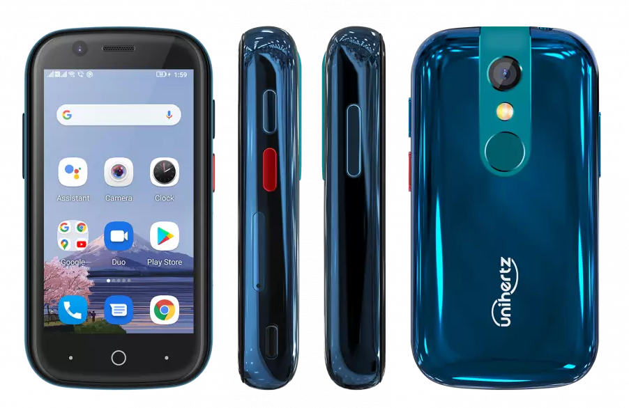

Common device configuration for the Unihertz Jelly2
=================================================
This common device tree is intended for the usage in a LineageOS or similar building environment.

If you are looking for a special device tree for the usage in a TWRP or similar environment head over to https://github.com/Meetoul/twrp_device_Unihertz_Jelly2.

The Unihertz Jelly2 (codenamed simply "Jelly2") is a smallest modern Android smartphone from Unihertz, released in March 1, 2021.

| Basic                   | Spec Sheet                                                                                                                     |
| -----------------------:|:------------------------------------------------------------------------------------------------------------------------------ |
| CPU                     | Octa-core                                                                                                                      |
| Chipset                 | Mediatek Helio P60                                                                                                             |
| GPU                     | Mali-G72 MP3                                                                                                                   |
| Memory                  | 6 GB RAM                                                                                                                       |
| Shipped Android Version | 10                                                                                                                             |
| Storage                 | 128 GB                                                                                                                         |
| Battery                 | Non-removable Li-Po 2000 mAh battery                                                                                           |
| Display                 | 480x854 pixels, 3.0 inch                                                                                                       |
| Camera (Rear - Main)    | 16MP                                                                                                                           |
| Camera (Front)          | 8MP                                                                                                                            |

# Dependencies

Additionally to this common device tree, you'll need model device tree

- [Jelly2 Region TEE (non-european union)](https://github.com/Meetoul/android_device_Unihertz_Jelly2_TEE)

## Releases

For the actual releases head on over to the device tree of the individual devices:

- [Jelly2 Region TEE (non-european union)](https://github.com/Meetoul/android_device_Unihertz_Jelly2_TEE/releases)

## Documentations

- [HOW-TO-BUILD.md](docs/HOW-TO-BUILD.md) - Building instructions for LineageOS 17.1.
- [HOW-TO-INSTALL.md](docs/HOW-TO-INSTALL.md) - Installation instructions for the Jelly2.
- [HOW-TO-UPDATE.md](docs/HOW-TO-UPDATE.md) - Update instructions for the Jelly.2
- [HOW-TO-EXTRACT_FILES.md](docs/HOW-TO-EXTRACT_FILES.md) - Instructions to extract files directly from the Jelly2 stock rom files.
- [HOW-TO-EXTRACT_SEPOLICY.md](docs/HOW-TO-EXTRACT_SEPOLICY.md) - A little guide to extract sepolicy rules from stock or phone.
- [HOW-TO-FLASH-STOCK.md](docs/HOW-TO-FLASH-STOCK.md) - Instructions on how to use the SP Flash Tool for MTK based devices.
- [HOW-TO-FLASH-SUPER.md](docs/HOW-TO-FLASH-SUPER.md) - Instructions on how to modify super.img and flashing it onto the device.

## Special Thanks To

- [ADeadTrousers](https://github.com/ADeadTrousers) - I used his [AtomL/XL device tree](https://github.com/ADeadTrousers/android_device_Unihertz_Atom_LXL) as a base for this one. Phones hardware are almost identical, so device trees are almost identical as well.
