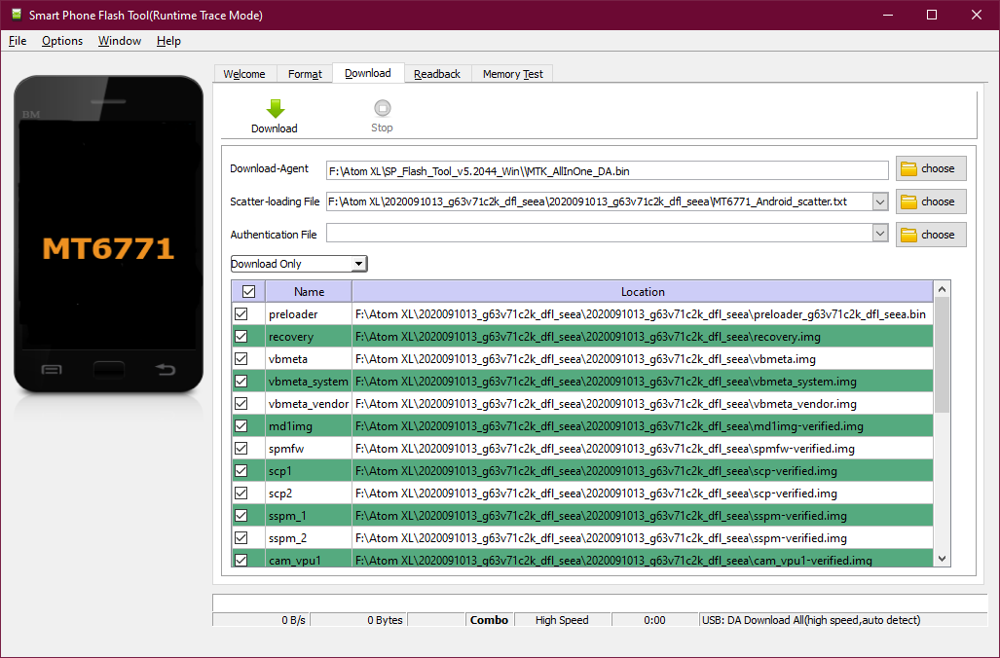

How to use the SP Flash Tool for MTK based devices.
=================================================

Let's say you don't want to use this awesome LineageOS ROM anymore or you just want to experince once more the bloated feeling of having so many apps you don't really use. Say no more.
In this guide I'll use Windows cause honestly that's the only way I know of and all other guides use it too but are not up-to-date.

## Installing the MTK USB Drivers

1. Download the [latest MTK USB Drivers](https://mtkusballdriver.com/). As of me writing this the latest version was v1.0.8.
2. Extracting the downloaded zip you should find an executable which you need to run.
3. Don't get startled because the installer is in chineese but it behaves like every other installer. Just click on the button that's normally entitled "Next" until the installer is finished.
4. What it does is simply extracting the real installer. By default it will create a folder on your desktop containing all necessary files.
5. Search for a folder starting with `Driver_Auto_Installer` and the highest number. As of me writing this it was `Driver_Auto_Installer_.1632`.
6. Exectue the installer inside this folder and follow the on screen instructions. Don't worry this time it's in english.
7. Maybe you need to restart and after that you are finished.

## Preparing the SP Flash Tool

1. Download the [latest SP Flash Tool](https://spflashtools.com/category/windows). As of me writing this the latest version was v5.2052.
2. Extract the downloaded zip to a folder of your choosing.

## Downloading the Stock ROM

1. Download the [latest Stock ROM](https://drive.google.com/drive/folders/1vdpRcZ2aGlpLCPVi3vh3EE6UjVZzSMq8?sort=13&direction=a).
2. Extract the downloaded zip to a folder of your choosing.

## Flashing the Stock ROM

Since the time Unihertz created their [instructions to flash a ROM](https://drive.google.com/drive/folders/0By1nhWOmuw2KdDhTUlFOZHpXQjg?sort=13&direction=a) and now a lot has changed in the SP Flash Tool. Gone are all those unnecessary port scans.

1. Start `flash_tool.exe`.
2. Choose the scatter file from the directory you extracted the stock ROM into.
3. Select `Firmware Upgrade` from the dropdown menu.
4. Hit `Download`.
5. Power down your phone.
6. Connect your phone to your PC.
7. Turn on your phone.
8. The flashing should begin right away.
